# PostgreSQL Presentation

Welcome to our presentation on PostgreSQL — an open-source, robust, and high-performance relational database system.

## Table of Contents
- [Part 01: What is a Database?](#part-01-what-is-a-database)
- [Part 02: Relational Database & PostgreSQL](#part-02-relational-database--postgresql)
- [Part 03: Why PostgreSQL](#part-03-why-postgresql)
- [Part 04: Hands-on Practice](#part-04-hands-on-practice)
- [Summary](#summary)
- [Q&A](#qa)

---

## Slide 1

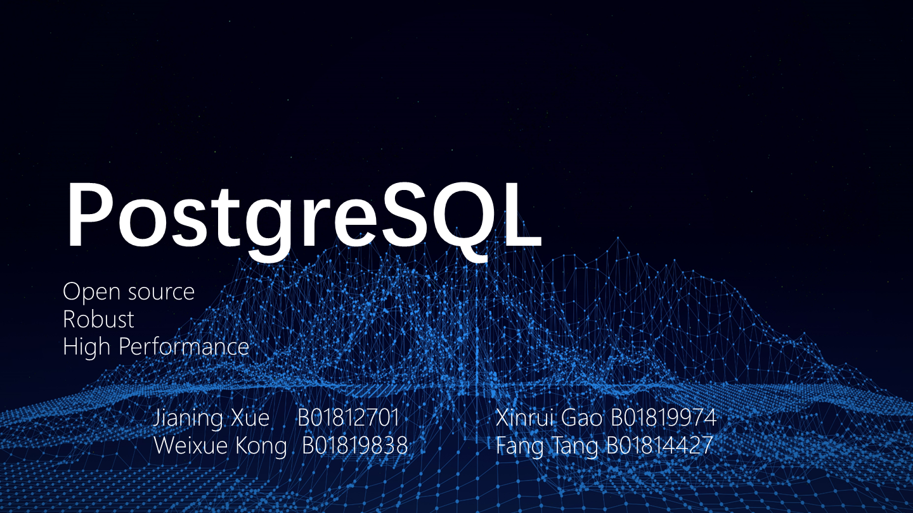

PostgreSQL  
Open source  
Robust  
High Performance  
Jianing Xue B01812701 | Xinrui Gao B01819974 | Weixue Kong B01819838 | Fang Tang B01814427

## Slide 2

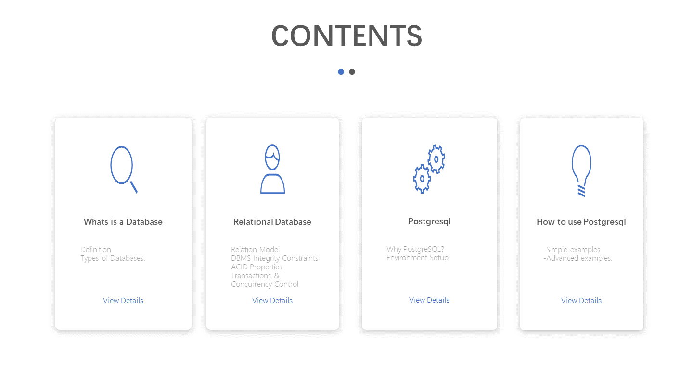

CONTENTS

## Slide 3

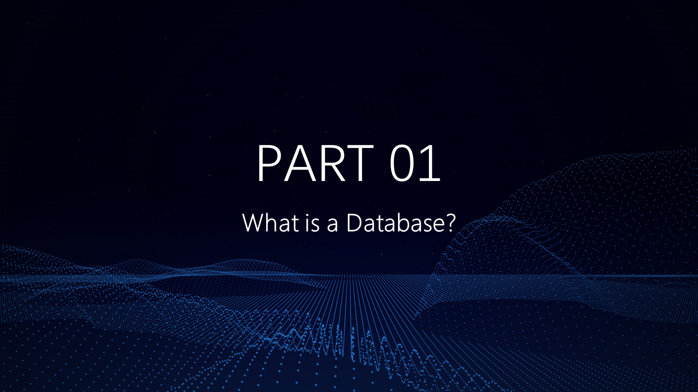

PART 01  
What is a Database?

## Slide 4

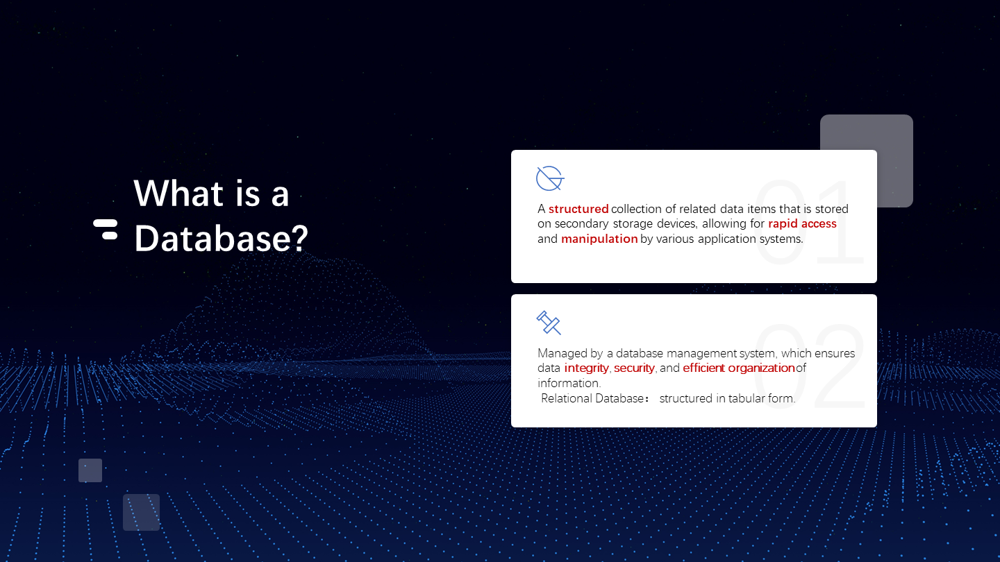

Managed by a database management system, which ensures data integrity, security, and efficient organization of information.  
Relational Database： structured in tabular form.

## Slide 5

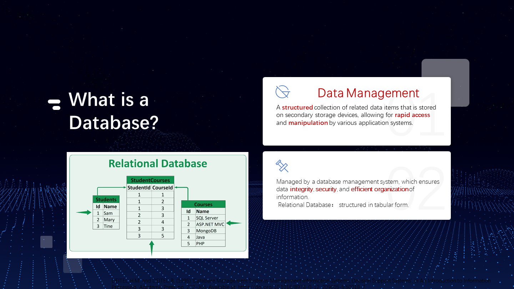

Data Management  
DEITEL, H.M. and DEITEL, B. (1986) ‘Database Management Systems, Management Information Systems, Decision Support Systems’, in *An Introduction to Information Processing*. Academic Press.

## Slide 6

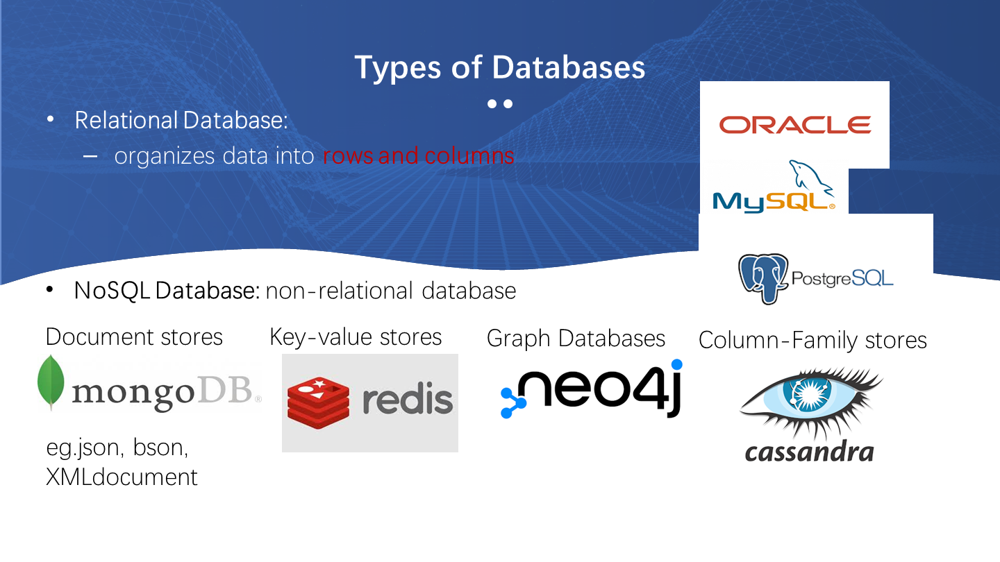

Types of Databases  
Relational Database: organizes data into rows and columns  
NoSQL Database: non-relational database  
Graph Databases  
e.g. JSON, BSON, XML

## Slide 7

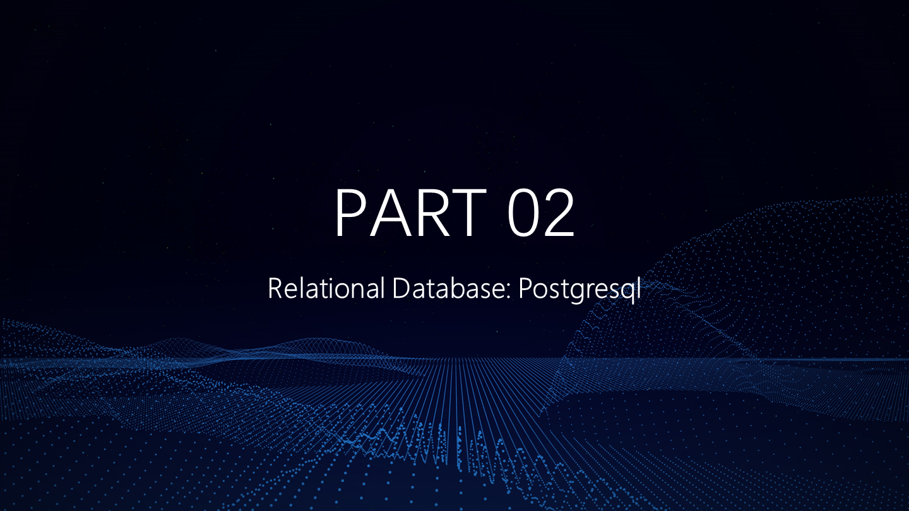

PART 02  
Relational Database: PostgreSQL

## Slide 8

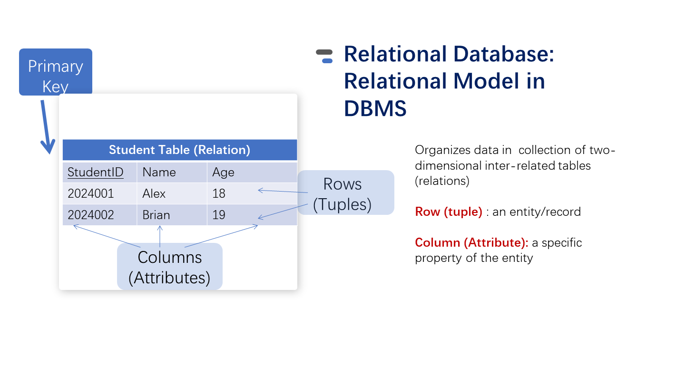

Rows (Tuples)  
Primary Key  
Columns (Attributes)  
Organizes data in two-dimensional interrelated tables (relations)

## Slide 9

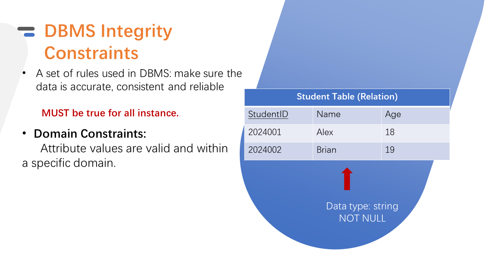

A set of rules used in DBMS: make sure the data is accurate, consistent, and reliable.  
Domain Constraints: ensure attribute values are valid and within a specific domain.  
Example: `NOT NULL`, specific data types.

## Slide 10

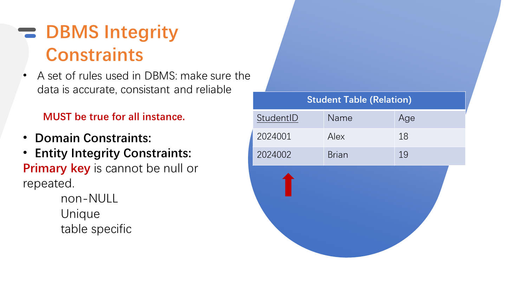

Entity Integrity Constraints:  
Primary key cannot be null or duplicated.  
Ensures each record is unique within its table.

## Slide 11

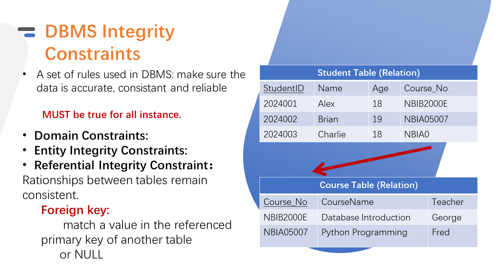

Referential Integrity Constraint：  
Ensures relationships between tables remain consistent.  
Foreign key values must match primary keys in the referenced table or be NULL.

## Slide 12

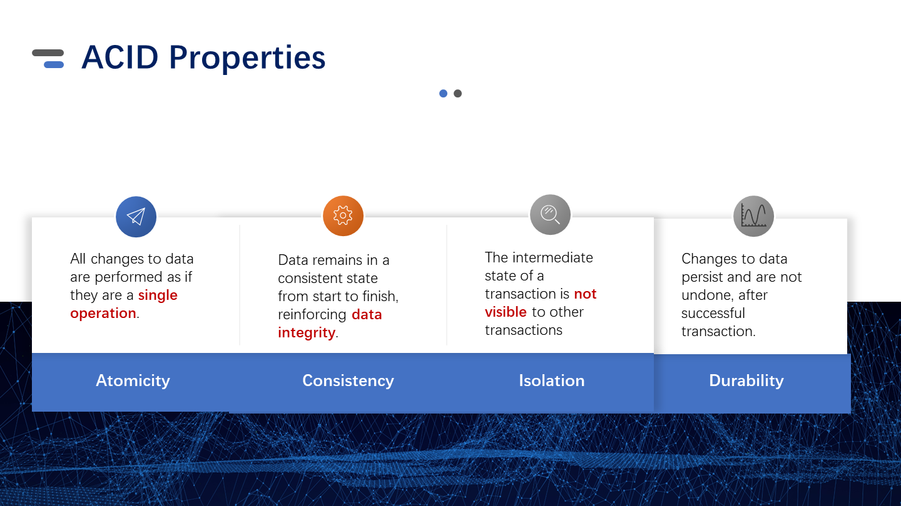

ACID Properties  
Atomicity, Consistency, Isolation, Durability  
Guarantees reliable transactions in PostgreSQL.

## Slide 13

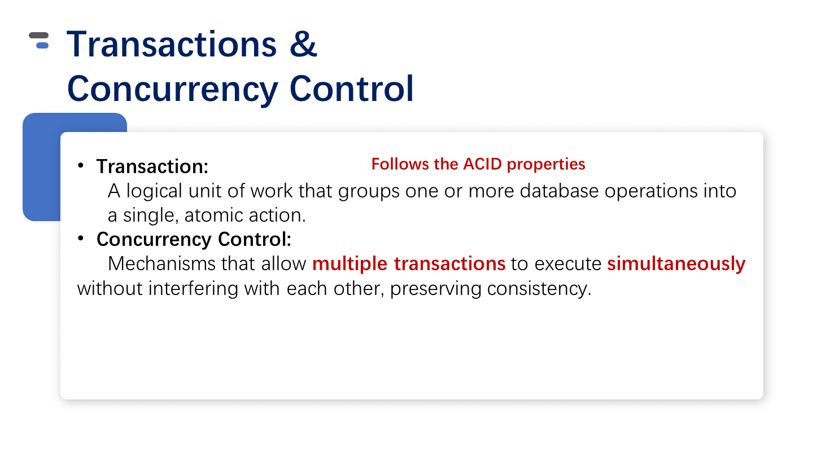

Transactions & Concurrency Control  
PostgreSQL ensures multiple transactions can run simultaneously without interfering.  
It uses the **ACID** principles.

## Slide 14

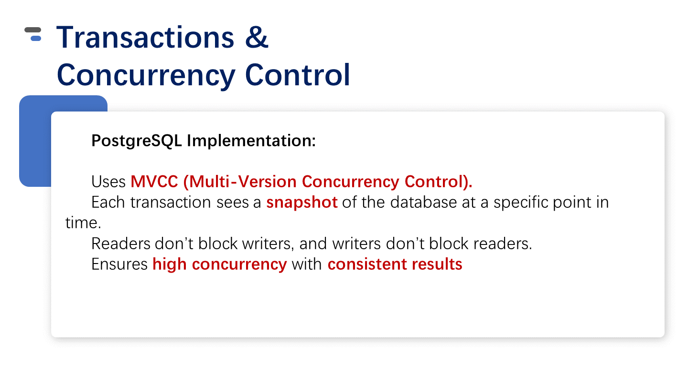

PostgreSQL Implementation  
Uses **MVCC (Multi-Version Concurrency Control)**  
Readers don’t block writers, writers don’t block readers.

## Slide 15

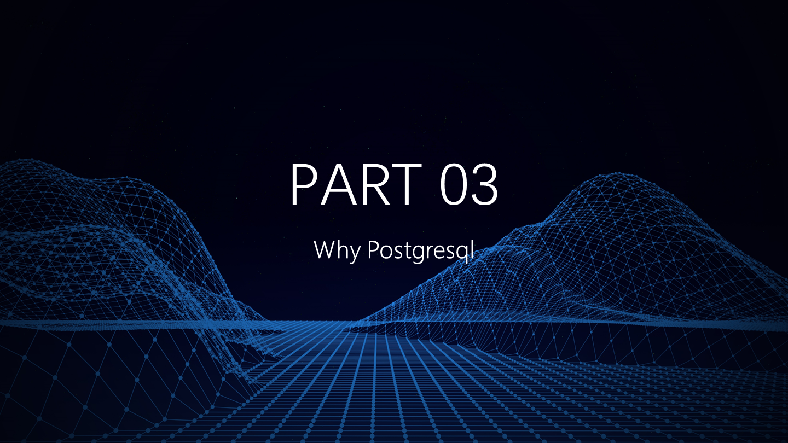

PART 03  
Why PostgreSQL

## Slide 16

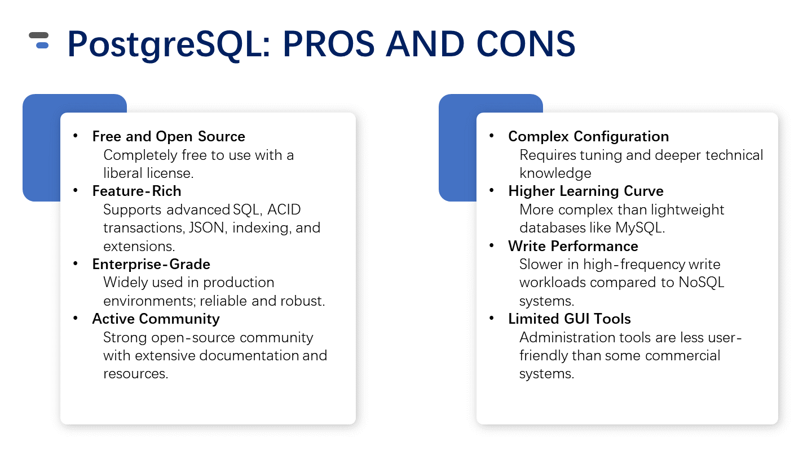

PostgreSQL: PROS AND CONS  
✅ Free and Open Source  
✅ Feature-Rich  
✅ Enterprise-Grade  
✅ Active Community  
⚠️ Complex configuration and higher learning curve

## Slide 17

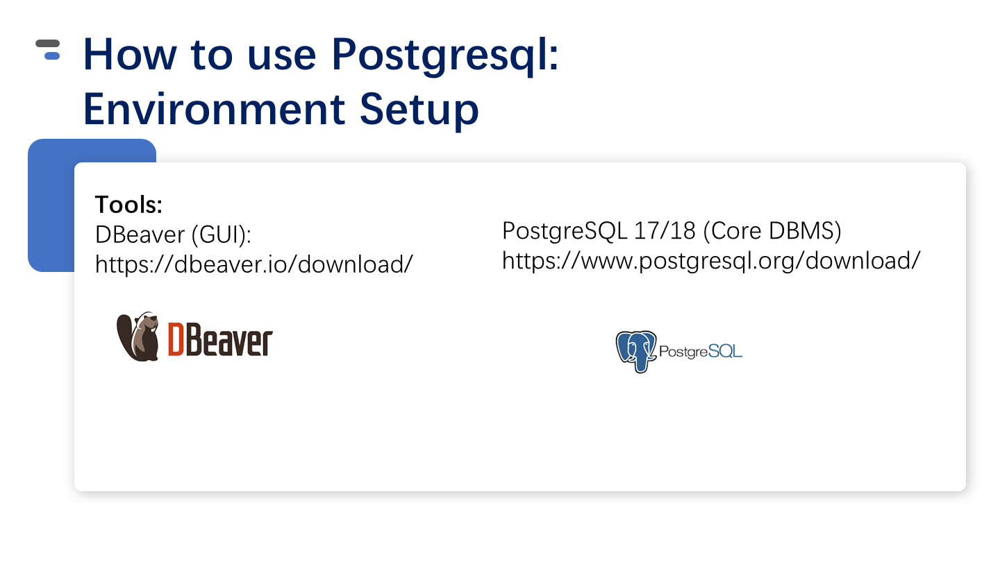

How to use PostgreSQL: Environment Setup  
Tools:  
- DBeaver (GUI): https://dbeaver.io/download/  
- PostgreSQL 17/18: https://www.postgresql.org/download/

---

## Slide 18 (Video)

<video src="../public/videos/slide18.mp4" controls></video>

**Topic:** Environment Setup Demo  
This video demonstrates how to install PostgreSQL and DBeaver,  
configure the connection, and test the environment successfully.

---

## Slide 19

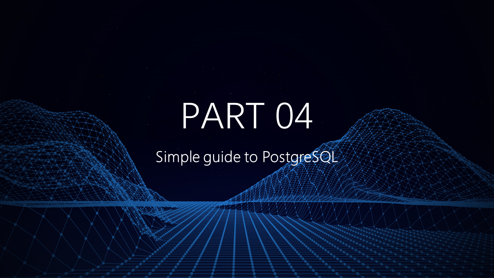

PART 04  
Simple Guide to PostgreSQL

---

## Slide 20 (Video)

<video src="../public/videos/slide20.mp4" controls></video>

**Topic:** Table Management  
In this demo, we create and manage PostgreSQL tables using DBeaver,  
showing how to define columns, primary keys, and relationships.

---

## Slide 21 (Video)

<video src="../public/videos/slide21.mp4" controls></video>

**Topic:** CRUD Operations  
This video demonstrates how to perform Create, Read, Update, and Delete operations using SQL commands and the DBeaver GUI.

---

## Slide 22 (Video)

<video src="../public/videos/slide22.mp4" controls></video>

**Topic:** Database Management  
Learn how to modify schemas, manage users, and optimize storage with PostgreSQL tools.

---

## Slide 23 (Video)

<video src="../public/videos/slide23.mp4" controls></video>

**Topic:** Transaction Management & Concurrency  
This segment shows how PostgreSQL handles concurrent transactions while maintaining ACID compliance.

---

## Slide 24 (Video)

<video src="../public/videos/slide24.mp4" controls></video>

**Topic:** MVCC Demonstration  
PostgreSQL’s Multi-Version Concurrency Control is shown in action, explaining how reads and writes remain isolated.

---

## Slide 25 (Video)

<video src="../public/videos/slide25.mp4" controls></video>

**Topic:** Partitioned Tables  
This video explains how partitioning works in PostgreSQL for large datasets to enhance query performance.

---

## Slide 26 (Video)

<video src="../public/videos/slide26.mp4" controls></video>

**Topic:** Python Connection  
Demonstrates how to connect to PostgreSQL using Python (`psycopg2`) and perform database queries programmatically.

---

## Slide 27

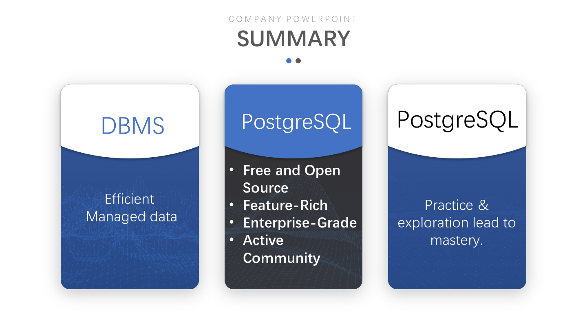

**SUMMARY**  
- PostgreSQL is free, feature-rich, and enterprise-grade.  
- Ensures high reliability and performance.  
- Practice and exploration lead to mastery!

---

## Slide 28

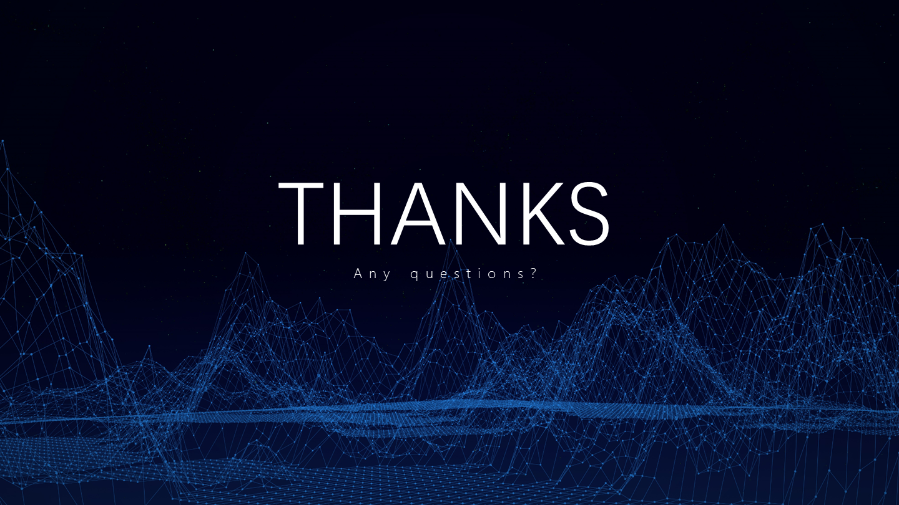

**THANK YOU** 🙏  
Any questions?
